# Course Robot使用说明

Course Robot中文译为课程机器人，是用于辅助学习“知学云”平台网上大学课程的浏览器扩展程序。

适用范围：中国移动、中国电信、中国人民保险、国家电投、中国石油、中国广核集团等企业使用“知学云在线学习平台”要求完成网上课程学习的员工。

## 软件特性

- 专题和活动等课程无人值守功能，自动完成视频、文档等课程学习。

- 考试界面支持复制和切屏。

- pdf文档下载支持，帮助复习和搜题。

## 兼容性

使用[Chrome Manifest V3]([Manifest V3 概述 · GitBook](https://doc.yilijishu.info/chrome/mv3-overview.html))开发，推荐使用Chrome浏览器88及以上版本和Edge浏览器安装，目前部分浏览器不兼容Chrome Manifest V3。

## 安装说明

以Chrome浏览器为例安装Course Robot扩展程序，其它浏览器大同小异。

1. 获取course-robot扩展程序安装包，Edge浏览器可在[微软应用商店](https://microsoftedge.microsoft.com/addons/detail/course-robot/iccmcglahjfomdcjgegidnjhjnajbfpo?hl=zh-CN)获取，其它浏览器下载[zip压缩包](https://gitee.com/snchengqi/course-robot/releases/download/1.5.0/course-robot.zip)。

2. 浏览器【设置-隐私和安全-网站设置-弹出式窗口和重定向-允许发送弹出式窗口并使用重定向列表】，添加https://kc.zhixueyun.com （如果公司知识中心三级域名不是kc.zhixueyun.com，则自行查看添加，或者设置默认允许网站可以发送弹出式窗口并使用重定向）
   
   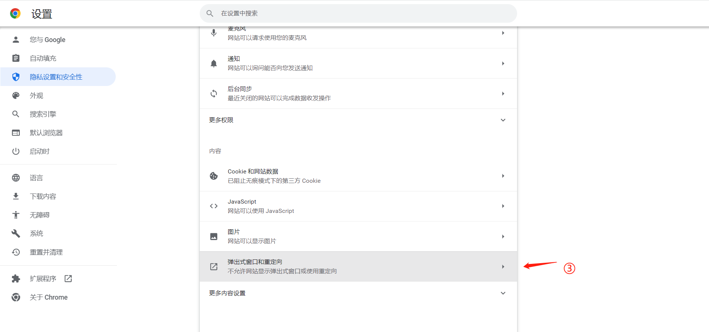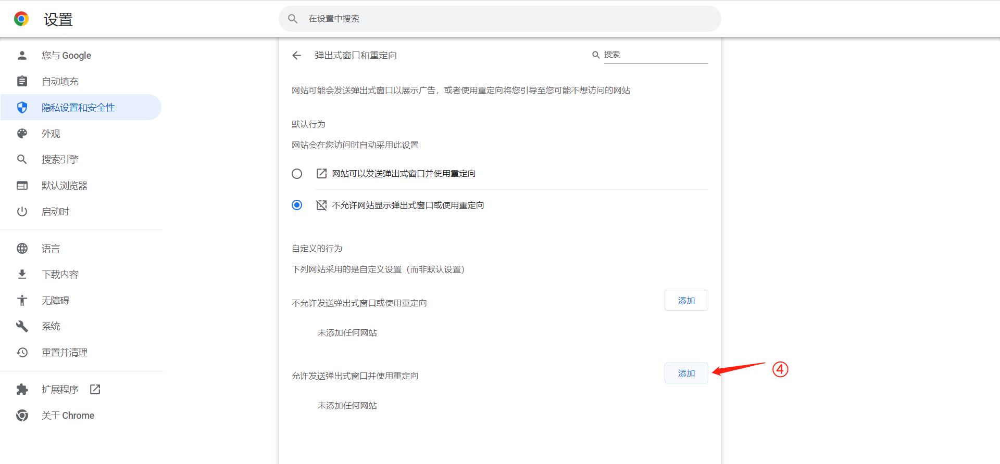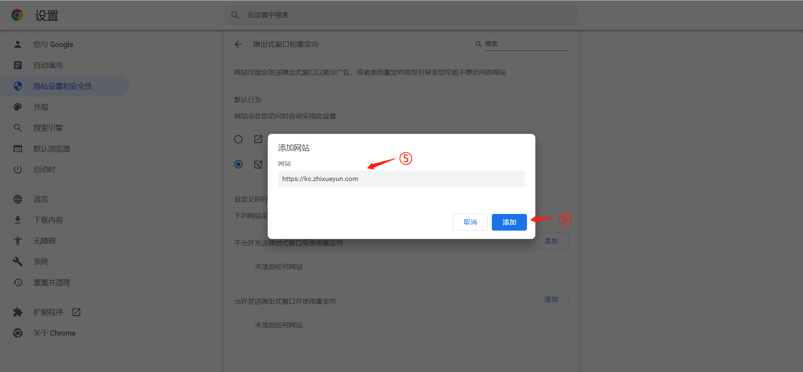

3. 如果你是下载的zip压缩包（如果你是通过微软商店获取，则默认已经完成安装，直接跳过此步骤。），将安装包解压缩，然后打开浏览器扩展程序管理界面，打开开发者模式，加载已解压的扩展程序，选择刚刚解压缩的course-robot文件夹。
   
   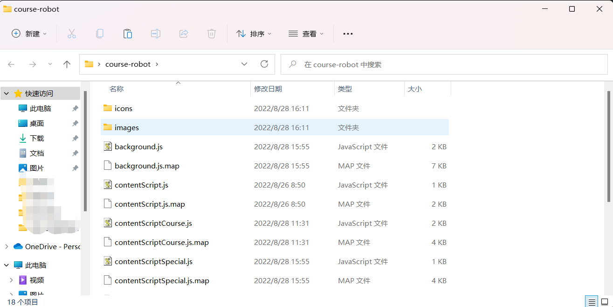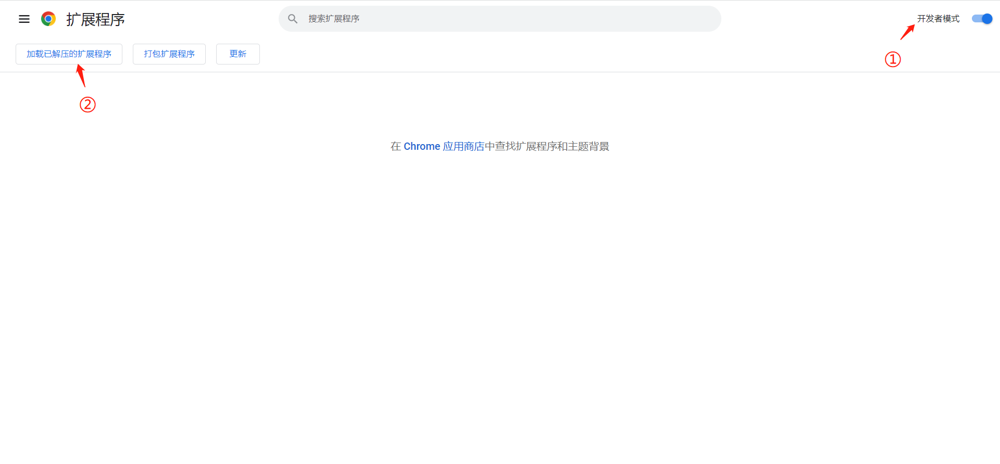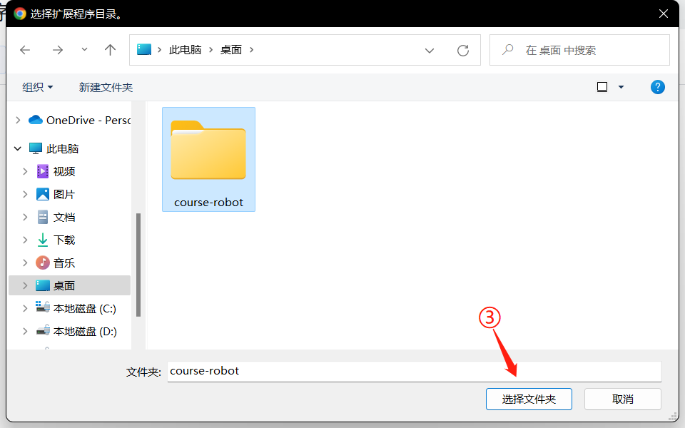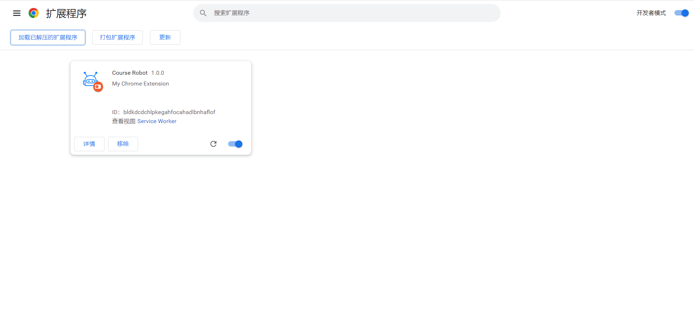

4. 将程序固定到浏览器工具栏
   
   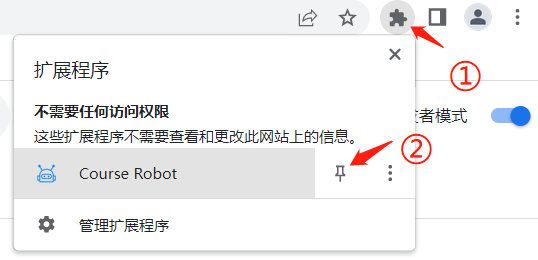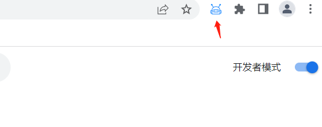

## 如何使用

##### 无人值守

1. 登录所在企业的学习平台，进入知识中心。以中国电信为例，登录中国电信网上大学-知识中心
   
   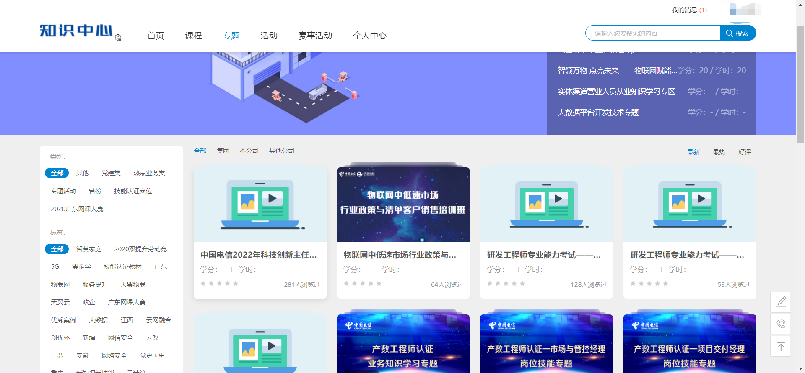

2. 选择要学习的专题，复制专题链接
   
   

3. 点击应用程序图标，填入复制的专题链接，开始学习
   
   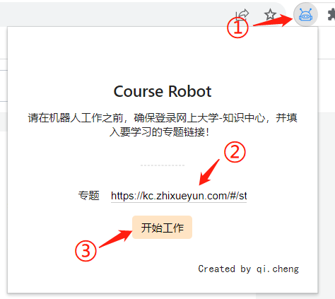

##### 允许复制切屏

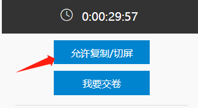

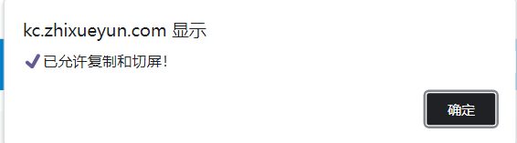

##### 下载pdf文档

## 注意事项

- 在开始学习之前一定要先登录知学云-知识中心，否则机器人不能工作

- 如果遇到问题，先点击结束学习按钮，然后再次点击开始工作
